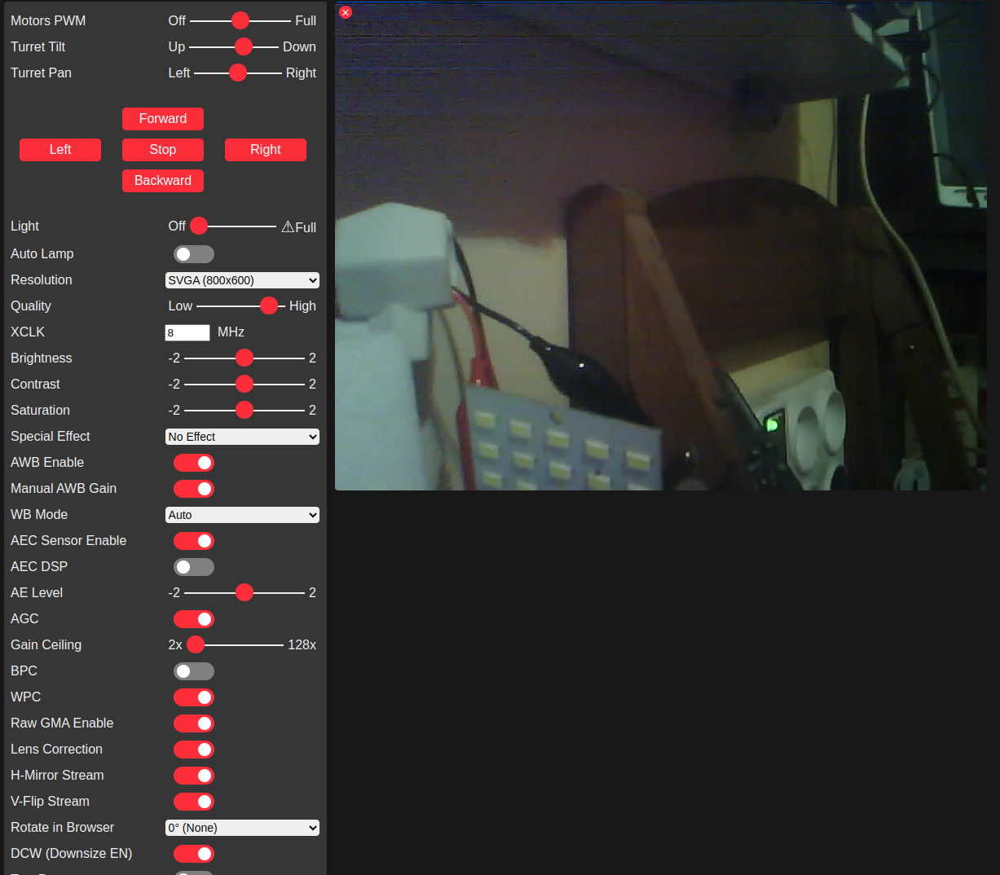

# ESP32CAMROBO
ESP32 Camera + Pan &amp; Tilt and DC Motor Control

Minor Development on Original Code : https://github.com/easytarget/esp32-cam-webserver

To get 4 Digital output (Motor Driver INs) & 3 PWM (2 for servo , 1 for Motor Driver PWM)

Related Article (in Persian) : https://vrgl.ir/7gJI1

